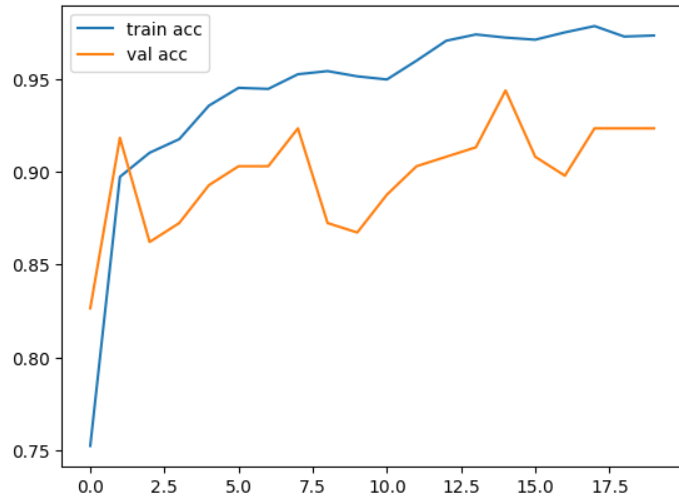
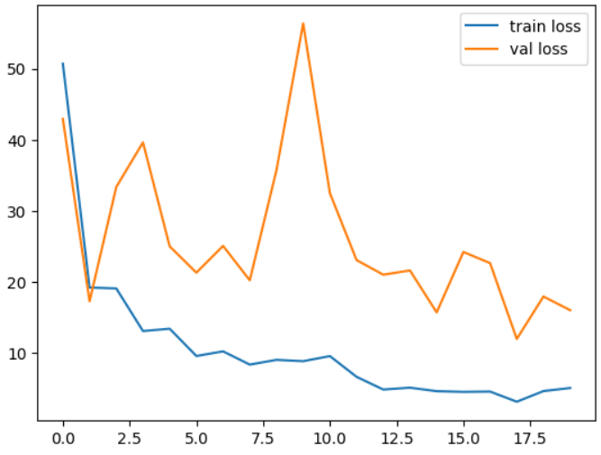

# Cotton Leaf Disease Prediction Using Transfer Learning

  

##  Introduction

In this Deep Learning Project build using Tensorflow-Keras , i used Transfer Learning in  RESNET152V2 Architecture to  classify images of the diseased cotton leaf,fresh cotton leaf,diseased cotton plant and fresh cotton plant

**Performance :**

  

  

## Purpose of the Project

by creating a end to end project with this model  will help the farmers to recognize the cotton plants which are Fresh and Diseased by simply uploading the pictures of the cotton plants on the web app.On further Production level this web app can be deployed as a android app which can make the farmers to click and upload their cotton plant picture and get results on the spot instantly

## Technology Stack

* [Tensorflow 2.x](https://www.tensorflow.org/)
* [Keras-Transfer-Learning](https://keras.io/api/applications/)
* [matplotlib](https://matplotlib.org/)
